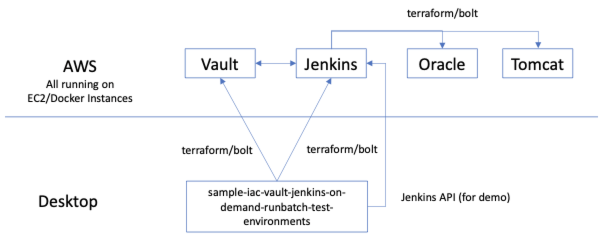

This project allows the viewer to exerience what the future could look like in a world wirh on-demand continuous delivery of test environments where AWS is operated by Terraform marionette, Vault is used as the central configuration and secrets manager, and Jenkins runs tests to 
on-demand environments.

Here's an overall diagram of what we're doing in this project:



To use this project, simply execute the following bash scripts.

```bash
./step_1_terraform_vault.sh
```
1. Use terraform to create an appropriate AWS EC2 instance for Vault.
2. Stores the Vault DNS at ~/.vault_dns

```bash
./step_2_provision_vault.sh
```
1. Use bolt to upload and execute the provisioning script on the Vault server.
2. The script sets up Docker on the EC2 instance, creates a Docker container from the latest Hasicorp supported DockerHub version of Vault, initializes the Vault instance, and then unseals the fresh Vault instance.
3. Stores the unsealed token for future access at ~/.vault_initial_root_token

```bash
./step_3_terraform_jenkins.sh
```
1. Use terraform to create an appropriate AWS EC2 instance for Jenkins.
2. Stores the Jenkins DNS at ~/.jenkins_dns

```bash
./step_4_provision_jenkins.sh
```
1. Create a DockerHub image for Jenkins that automates the unlocking and plugin provisioning for the CI server.  
2. Use bolt to upload and execute the provisioning script on the Jenkins server.
3. The script sets up Docker on the EC2 instance, creates a Docker container from the DockerHub image we just created, and initializes Jenkins.
4. XYZZY Use Jenkins API to create a job (this project!), which will clone this repository and execute the next script on the AWS EC2 Jenkins Instance).
   /var/jenkins_home/workspace/TEST/build_1_run_unit_tests.sh

```bash
./step_5_initiate_jenkins_build_and_test.sh
```
1. Utilizing the Jenkins REST API, create a TESTJOB on the Jenkins server we created.
2. Utilizing the Jenkins REST API, run the TESTJOB on the Jenkins server we created.  This will
- Terraform Oracle and Tomcat instances in AWS
- Provision those instances
- Run the tests in those instances
- Teardown everything

```bash
./build_and_test_6_teardown.sh
```
1. Use the power of terraform to destroy all that which it created
2. Clean up other debris, such as hidden files for dns names of Vault and Jenkins servers, tokens, etc.


And here's some of the concepts, humoursly presented:


